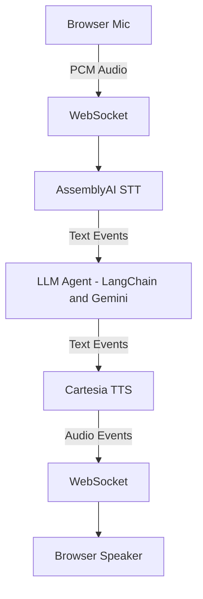

# Voice Sandwich Agent 🥪

A real-time **voice-to-voice AI interview preparation agent** built as a streaming voice pipeline using Speech-to-Text, an LLM agent, and Text-to-Speech.

The system conducts **spoken mock interviews**: it listens to the candidate’s voice, transcribes answers in real time, evaluates responses using an LLM, and speaks back scores, feedback, and follow-up questions — all over WebSockets.

---

## High-Level Architecture


The entire pipeline is **event-driven and streaming**, enabling low-latency, real-time interaction.

---

## Pipeline Overview

The backend is composed of **three streaming stages**, each implemented as an async generator:

1. **STT Stage**
   - Streams raw PCM audio to AssemblyAI
   - Emits partial and final transcription events

2. **Agent Stage**
   - Triggers only on final transcripts
   - Conducts role-based interview questioning
   - Streams LLM responses token-by-token
   - Emits agent, tool call, and tool result events

3. **TTS Stage**
   - Converts agent responses into streaming audio
   - Emits playable audio chunks in real time

All stages communicate through a **shared event stream**.

---

## Event-Driven Design

The pipeline uses a unified event model to decouple components.

Key event types include:

- `stt_chunk` – partial transcription
- `stt_output` – final transcription
- `agent_chunk` – streaming LLM output
- `tool_call` / `tool_result` – agent tool usage
- `agent_end` – end of agent response
- `tts_chunk` – streaming audio output

---

## Prerequisites

- **Python** 3.11+
- **Node.js** 18+
- **pnpm** or **uv**

---

## API Keys

Create a `.env` file with the following variables:

```env
ASSEMBLYAI_API_KEY=your_key_here
CARTESIA_API_KEY=your_key_here
GOOGLE_API_KEY=your_key_here
```

## Quick Start

### Using Make (Recommended)

```bash
# Install all dependencies
make bootstrap

# Run Python backend + web frontend
make dev-py
```

The app will be available at `http://localhost:8000`

### Manual Setup (Python)

```bash
cd components/python
uv sync --dev

cd ../web
pnpm install
pnpm build

cd ../python
uv run src/main.py
```

## Project Structure

```
components/
├── web/                 # Frontend UI
│   └── src/
└── python/              # Python backend
    └── src/
        ├── main.py             # Main server & pipeline
        ├── assemblyai_stt.py   # Streaming STT client
        ├── cartesia_tts.py     # Streaming TTS client
        ├── utils.py            # Async stream utilities
        └── events.py           # Event type definitions
```

## Event Types

The pipeline communicates via a unified event stream:

| Event | Direction | Description |
|-------|-----------|-------------|
| `stt_chunk` | STT → Client | Partial transcription (real-time feedback) |
| `stt_output` | STT → Agent | Final transcription |
| `agent_chunk` | Agent → TTS | Text chunk from agent response |
| `tool_call` | Agent → Client | Tool invocation |
| `tool_result` | Agent → Client | Tool execution result |
| `agent_end` | Agent → TTS | Signals end of agent turn |
| `tts_chunk` | TTS → Client | Audio chunk for playback |

## Notes

- The current version assumes clean turn-taking.
- Handling mid-sentence interruptions (barge-in) is a known future improvement.

## Why This Project

This demo focuses on:

- Streaming AI systems
- Async, event-driven design
- Real-time STT + LLM + TTS integration
- Production-style voice agent architecture
---
